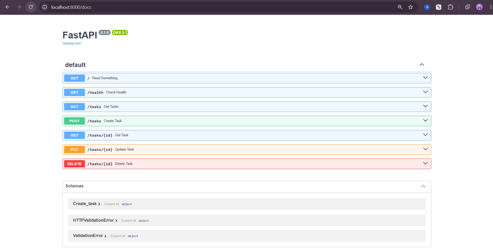
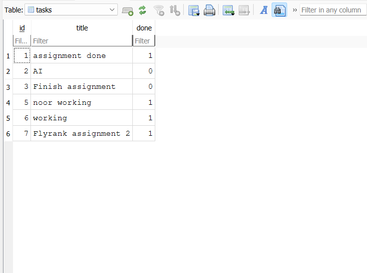

# Building CRUD API

A simple CRUD API for managing tasks, built with FastAPI as part of a Backend AI Engineering assignment at FlyRank AI. Supports creating, reading, updating, and deleting tasks with persistent storage via SQLite (using Python's built-in `sqlite3` module).

## Tech Stack

- Python
- FastAPI
- Uvicorn
- Pydantic
- SQLite

## Setup

1. Clone the repository
2. Create a virtual environment:

python -m venv venv

3. Activate the virtual environment:
   - Windows: `venv\Scripts\Activate.ps1`
   - Mac/Linux: `source venv/bin/activate`

4. Install dependencies:

pip install -r requirements.txt

5. Run the server:

uvicorn main:app --reload

6. The API will be running at `http://localhost:8000`. On first run, `tasks.db` is created automatically with the `tasks` table and a few example tasks — no manual database setup needed.

## Endpoints

| Method | Path         | Description                   |
|--------|--------------|-------------------------------|
| GET    | /            | Hello world / basic check     |
| GET    | /health      | API status info               |
| GET    | /tasks       | List all tasks                |
| GET    | /tasks/{id}  | Get a single task by id       |
| POST   | /tasks       | Create a new task             |
| PUT    | /tasks/{id}  | Update an existing task       |
| DELETE | /tasks/{id}  | Delete a task                 |

## API Docs

Interactive Swagger documentation is available at:

http://localhost:8000/docs



## Database

This project uses SQLite for persistent storage, via Python's built-in `sqlite3` module. It requires no separate database server, stores everything in a single file, and data survives server restarts, a good fit for a small project like this.

The database file (`tasks.db`) is created automatically in the project root the first time the server starts. It's excluded from version control via `.gitignore`, since it's generated data, not source code.

### Example SQL query

```sql
SELECT * FROM tasks WHERE done = 1;
```

